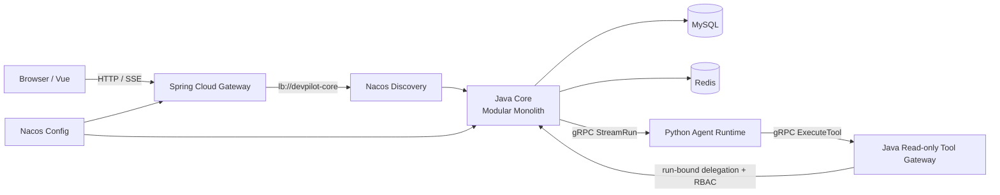
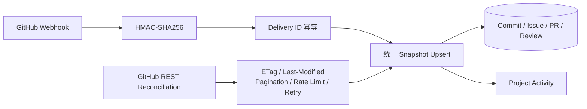
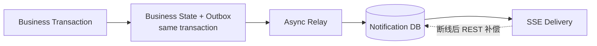
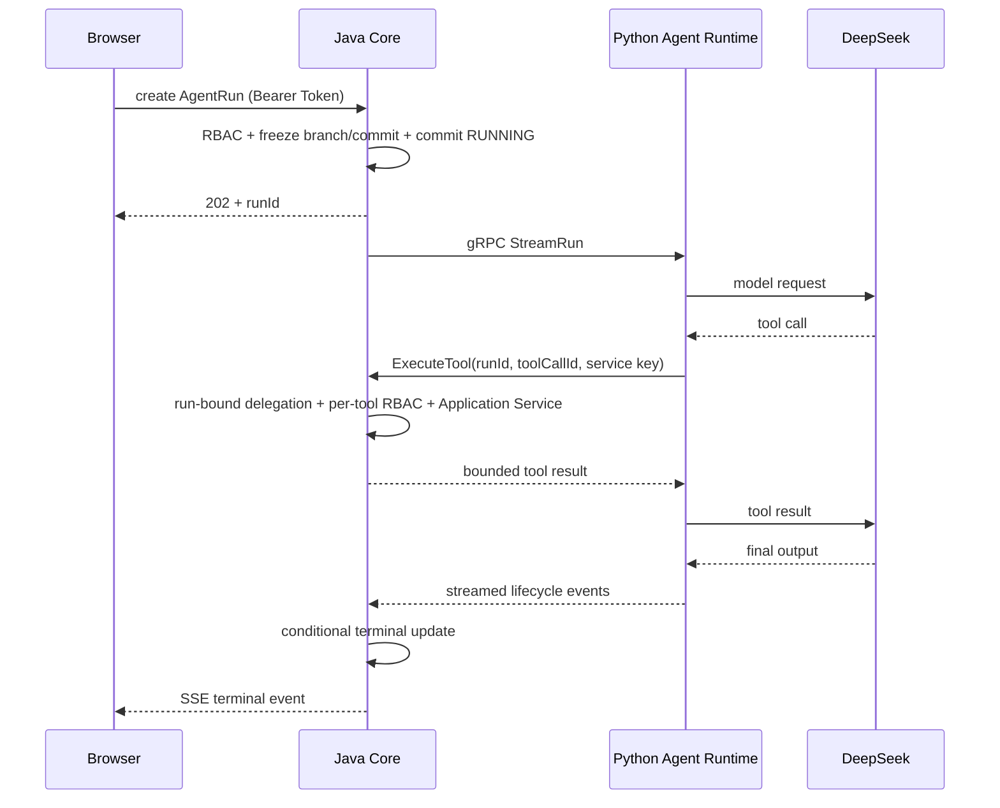

# DevPilot

面向小型开发团队的 GitHub 协作与 AI 工程助手。
DevPilot 汇聚真实研发活动与团队协作上下文，由 Java Core 维护可靠业务、事务和权限边界，
并把 Python Agent Runtime 作为独立服务，通过受控的只读 Tool Gateway 使用业务能力。

**Java 21 · Spring Boot · Spring Cloud Gateway · Nacos · MySQL · Redis · gRPC · Python · Vue 3**

## DevPilot 能做什么

GitHub 擅长管理代码和研发事件，DevPilot 管理团队内部的 Workspace、Project、Task、Notification 与 Audit，
再为 Agent 提供一个经过鉴权、可审计、不会绕过业务规则的项目上下文入口。它不是 GitHub 的复刻，而是连接
GitHub 研发活动、本地协作业务和 Agent Runtime 的上下文层。

- Workspace / Project / Member / 分层 RBAC
- GitHub Repository / Branch / Commit / Issue / PR / Review 同步
- Task / Activity / Notification / Audit
- Transactional Outbox 与可恢复异步处理
- Agent Run / SSE / 三个 read-only Tool
- Gateway / Nacos Discovery / Nacos Config 服务治理

## 系统架构



真正的独立运行边界只有：

- `devpilot-web`：Vue 静态前端交付单元，Nginx 反向代理 HTTP/SSE。
- `devpilot-gateway`：WebFlux Edge Service，通过 Nacos 与 LoadBalancer 路由到 Core。
- `devpilot-core`：Spring MVC 模块化单体，拥有认证、RBAC、事务、数据与业务规则。
- `agent-service`：独立 Python Agent Runtime，负责 AgentLoop、DeepSeek 与 Tool Registry。

`identity`、`project`、`github`、`task`、`notification`、`outbox`、`audit`、`agent` 是 Core 内的 Maven
业务模块，不是微服务。Gateway 不做 Project RBAC，Python 不直连业务数据库，双向 Agent gRPC 也不经过 Gateway。

## 三条关键业务链

### 1. GitHub 可靠同步



Webhook 是实时路径，REST Reconciliation 是丢失事件、首次绑定和周期校准的兜底路径。两条路径汇合到同一
Upsert：Repository ID + SHA 或 stable GitHub ID 防重复，`github_updated_at` 拒绝乱序覆盖，乐观版本处理本地并发。
外部 API 只对安全读请求做有限重试，并处理条件请求、Link 分页与 Rate Limit。

### 2. Reliable Event 与通知



业务状态与 Outbox 在同一 MySQL 事务提交。Outbox 具有
`PENDING → PROCESSING → RETRY_WAIT → PROCESSED / DEAD` 状态机、有限退避、stale recovery、唯一约束与
条件终态更新。Notification DB 是可靠事实；SSE 只是低延迟投递通道，发送失败不会回滚已经提交的业务事务。

### 3. Agent 受控执行



Java 保留认证和业务所有权；浏览器 Token 不交给 Python，Tool 不访问 Mapper/DAO，而是回到 Java Application Service
再次做 run-bound delegation 与 RBAC。当前只开放：

- `project.get_summary`
- `task.list_open`
- `project.list_recent_activity`

它们全部是 read-only。写 Tool、Proposal / HITL、执行幂等与更细审计属于后续安全演进，不是当前已实现能力。

## 核心技术亮点

### GitHub 外部系统可靠同步

HMAC-SHA256 Webhook、Delivery ID 幂等、Webhook + REST 对账、ETag / Last-Modified、Link Pagination、Rate Limit、
有限重试、时间戳防乱序和乐观锁共同处理外部系统常见的重复、延迟、乱序和短暂失败。

### Transactional Outbox 与数据库可靠性

业务状态和事件意图同事务持久化，后台 Worker 通过 version claim 与有界线程池处理；失败进入退避或 DEAD，
stale PROCESSING 可恢复。唯一索引和条件终态更新使重试不会依赖“Exactly Once”口号。

### Java / Python Agent 边界

Java 负责权限、事务、业务与 Run 权威状态，Python 负责模型编排；Protobuf/gRPC Server Streaming 接到浏览器 SSE。
内部 service key、消息大小限制、Deadline、Cancel propagation、Circuit Breaker 与 Semaphore Bulkhead 约束故障域。

### Spring Cloud 服务治理

Gateway 通过 `lb://devpilot-core` 与 Nacos Discovery 找到 Core；Nacos Config 只保存可公开的非敏感配置，且关闭动态刷新。
普通 REST 有短超时，SSE Route 显式取消响应超时，避免长连接继承错误的边缘策略。

### 可观测与可验证工程

Flyway 管理数据库版本，Actuator 提供 liveness/readiness/metrics，Micrometer 暴露 Outbox、GitHub、Notification backlog
与失败指标。ArchUnit 检查模块和分层边界，Testcontainers 覆盖真实 MySQL/Redis 集成，CI 运行完整 Maven Verify。

## 代码地图

| 路径 | 职责 |
|---|---|
| `devpilot-boot` | Java Core 组合根、运行配置、Flyway 与 HTTP 入口 |
| `devpilot-framework` | 中立的 API、错误与基础约定 |
| `devpilot-identity` | 注册、登录、不透明 Access Token、Email Verification |
| `devpilot-project` | Workspace / Project / Member / Activity / RBAC |
| `devpilot-github` | Binding、Webhook、REST Client、Snapshot 与 Reconciliation |
| `devpilot-task` | Task 状态机、History 与 GitHub Snapshot 关联 |
| `devpilot-outbox` | Transactional Outbox 状态机与 Relay |
| `devpilot-notification` | 可靠通知记录、提醒扫描与 SSE |
| `devpilot-audit` | 审计和失败补偿记录 |
| `devpilot-agent` | AgentRun、Java gRPC Client、Tool Gateway、SSE |
| `devpilot-gateway` | Gateway、Nacos Discovery/Config 与 HTTP/SSE 路由 |
| `agent-service` | Python AgentLoop、DeepSeek Provider、Tool Registry 与 gRPC Server |
| `devpilot-web` | Vue 3 / Pinia / Element Plus 前端 |

## Security / Production Evolution

### Current：本地与演示

Repository Binding 在 MySQL 只保存 `api_credential_ref` 与 `webhook_secret_ref`，例如指向
`DEVPILOT_GITHUB_API_TOKEN_LOCAL`。Environment Resolver 在运行时取得 Secret；Secret 不进入数据库、Git、镜像或 API
Response。这个迁移接缝适合个人项目、少量固定仓库和单实例演示。

它不适合 1000 用户 / 10000 Repository 的 SaaS：高基数环境变量无法良好支持租户生命周期、轮换、审计、多实例分发
和 user-managed credential。

### Production design：GitHub App 优先

生产首选 GitHub App。Binding 保存 `installationId`、`repositoryId` 与业务关联；App private key 和 Webhook secret
进入 Secret Manager / KMS。Java 按 installationId 生成 App JWT，换取短期 installation access token，并只缓存到临近
过期。权限按 least privilege 配置，不长期保存每个用户的 PAT。

若必须兼容 fine-grained PAT，则由 Credential Service 使用 KMS envelope encryption 保存 ciphertext、nonce、encrypted data
key、key version 与 rotation metadata；业务表仍只保存 credential ID/reference。Secret 仅在调用 GitHub 时短暂解密到内存，
不进入日志、Response 或普通配置中心。上述是生产设计目标，本仓库没有冒充已经实现 KMS 或 GitHub App installation flow。

| 场景 | 当前本地/演示 | 生产建议（尚未实现） |
|---|---|---|
| GitHub API | ENV-referenced PAT | GitHub App installation token |
| Webhook secret | ENV reference | Secret Manager |
| App private key | N/A | Secret Manager / KMS |
| PAT fallback | ENV reference | Envelope-encrypted credential record |
| Agent internal key | ENV | Secret Manager，后续评估 mTLS |
| DeepSeek key | ENV | Secret Manager |

## 当前边界

- Agent Tool 当前只有只读能力，没有 Proposal / HITL 或写业务动作。
- Agent 与 Notification SSE replay buffer 位于单个 Core JVM；Java 重启或 replay gap 后以 REST 权威状态补偿。
- 本地 Nacos 关闭认证，只用于受控本机网络；不是生产部署模板。
- GitHub local binding 使用 ENV PAT；GitHub App 是生产设计目标，尚未实现 installation callback。
- Python Agent 尚未注册 Nacos，通过 Compose 内部 DNS 被 Core 直接访问。
- 本项目提供可复现的本地全栈部署，不宣称已验证多副本、跨区域或互联网生产运行。
- GitHub.com 无法向 localhost 主动投递 Webhook；真正的 Webhook E2E 需要公网 HTTPS 入口。

## Deployment

以下是 **reproducible local full-stack deployment**，不是可直接照抄的互联网生产模板。

### Requirements

- Docker Desktop / Docker Engine 与 Docker Compose
- 一个真实的 DeepSeek API Key
- GitHub Repository 集成时需要测试仓库的 fine-grained PAT 与独立 Webhook secret

仅开发 Java Core 时仍可只启动基础设施：

```powershell
docker compose up -d mysql redis
```

### 1. 配置 `.env`

```powershell
Copy-Item .env.example .env
```

至少填写：

```dotenv
DEVPILOT_MYSQL_PASSWORD=<local-password>
DEVPILOT_MYSQL_ROOT_PASSWORD=<different-local-password>
DEVPILOT_REDIS_PASSWORD=<local-password>
DEVPILOT_AGENT_TOOL_SERVICE_KEY=<independent-random-value-at-least-16-chars>
DEEPSEEK_API_KEY=<real-key>
```

绑定 GitHub Repository 前再填写 `DEVPILOT_GITHUB_API_TOKEN_LOCAL` 与
`DEVPILOT_GITHUB_WEBHOOK_SECRET_LOCAL`。Binding 请求传环境变量名作为 reference，不传 Secret 值。

`.env` 已排除版本控制，Dockerfile 也不会复制它；但 `docker compose config` 会展开环境变量，分享其输出前必须脱敏。

### 2. 启动完整本地全栈

```powershell
docker compose --profile full up -d --build
docker compose --profile full ps
```

`nacos-config-init` 会等待 Nacos Healthy，自动发布 `devpilot-core.yml` 和 `devpilot-gateway.yml` 后以 0 退出；Core 与
Gateway 只有在配置发布成功后才启动。Full Profile 固定 `AGENT_MODEL_MODE=deepseek`，不会以 FakeModel 冒充完整部署。

### 3. 入口与端口

| 入口 | 默认地址 | 用途 |
|---|---|---|
| Web | http://localhost:5173 | 用户唯一主入口，Nginx 代理 API 与 SSE |
| Mailpit | http://localhost:8025 | 读取真实 SMTP Adapter 投递的注册验证码 |
| Gateway | http://localhost:8081 | 调试 Edge Service |
| Core | http://localhost:8080 | 调试 Core / readiness |
| Nacos Console | http://localhost:8082 | 本地服务与配置检查 |
| MySQL | localhost:3307 | 本地数据库调试 |
| Redis | localhost:6380 | 本地缓存调试 |

Agent `:50051` 与 Java Tool Gateway `:50052` 仅暴露在 Compose 网络内。

### 4. First-use workflow

1. 在 Web 注册页申请验证码。
2. 打开 Mailpit，读取 SMTP 收件箱中的真实验证码并完成注册。
3. 登录并通过 `/auth/me` 验证会话，创建 Workspace 与 Project。
4. 可选：用 ENV credential reference 绑定真实 GitHub 测试仓库，验证 metadata、Branch HEAD 与 API sync。
5. 准备 Project/Task/Activity 后发起 Agent Run，观察 Tool lifecycle、SSE terminal 与历史权威状态。
6. 通过真实业务动作检查 Outbox terminal、Notification DB 与 SSE delivery。

容器 Healthy 只证明依赖就绪，不等于上述应用链路已经通过。

### 5. GitHub Webhook 的公网 HTTPS

本地 Full Stack 可真实调用 GitHub API，但 GitHub.com 不能访问 localhost。完整 Webhook Internet E2E 需要部署域名、
Cloudflare Tunnel 或 ngrok 等公网 HTTPS 入口，将 Webhook URL 指向：

```text
https://<public-host>/api/v1/github/webhooks
```

在 GitHub Delivery 页面确认真实请求获得 2xx。不要用本地伪 payload 代替这项验收，也不要把临时 tunnel 当作生产设计。

### 6. 停止

```powershell
docker compose --profile full down
```

该命令保留 MySQL、Redis 与 Mailpit named volumes；只有明确需要清空本地数据时才额外处理 volumes。
