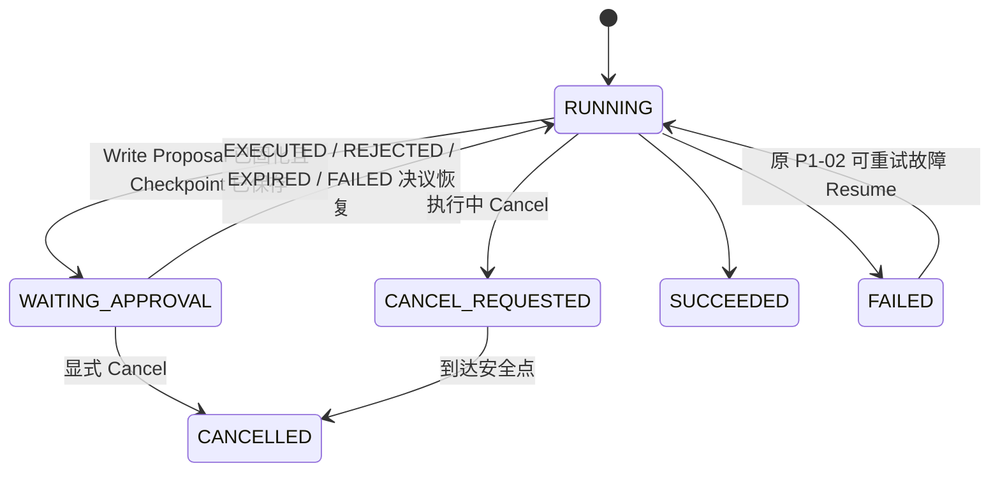
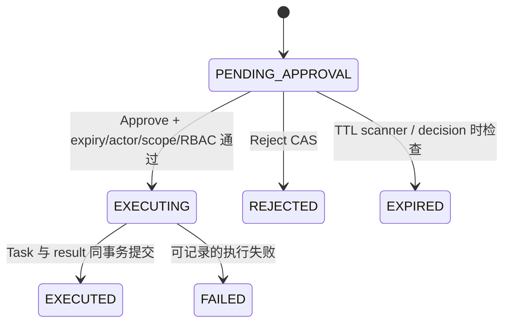

# P1-03 `task.create`、Proposal 与人工审批

本轮以提交 `5005d8be68b7755582dccae56ea68e1eefe39133` 为基线，在 `agent` 分支继续实现。
Python 仍不访问 `dp_*`；Java Core 保存授权记录、执行 RBAC、管理事务并产生真实 Task。已有 Cancel、失败 Resume
和 Checkpoint 语义继续有效。本轮没有引入 LangGraph、MCP、RAG 或 Multi-Agent。

## A. 更新文件地图

### 新增文件

| 文件 | 职责与调用关系 |
|---|---|
| `devpilot-boot/.../V18__add_agent_tool_proposal.sql` | MySQL Flyway 迁移；增加 WAITING_APPROVAL 与 `dp_agent_tool_proposal`，约束状态、scope、唯一 ToolCall 和幂等键 |
| `devpilot-agent/.../application/tool/AgentToolRisk.java` | Java 受信任风险枚举；三个现有 Tool 为 READ_ONLY，task.create 为 WRITE_REQUIRES_APPROVAL |
| `devpilot-agent/.../application/proposal/*` | Proposal command、payload 规范化、状态机、CAS 服务、HTTP/scheduler 编排和 TTL 扫描 |
| `devpilot-agent/.../persistence/entity/AgentToolProposalEntity.java` | Proposal 数据库实体；保存 exact payload、hash、actor/scope、时间、决议和执行结果 |
| `devpilot-agent/.../persistence/mapper/AgentToolProposalMapper.java` | 插入、按 scope 查询、`FOR UPDATE`、status/version CAS、过期扫描 |
| `devpilot-agent/.../api/AgentToolProposalController.java` | Browser GET/decision 入口；decision body 没有 Tool 参数 |
| `devpilot-agent/.../api/dto/AgentToolProposal*.java` | 页面可读 Proposal 和仅含 decision 的输入 DTO |
| `devpilot-agent/.../application/AgentApprovalResumeCommand.java` | Java 调 Python ResumeApproval 的最小内部命令 |
| `agent-service/tests/test_write_tool_approval.py` | Python Risk Policy、持久等待、Approve/Reject/Expire/Failed 恢复及 RPC worker 释放测试 |
| `devpilot-agent/.../proposal/AgentToolProposalServiceTest.java` | exact payload、TTL、重复批准、CAS、撤权和最多一次 Task 创建测试 |
| `agent-service/docs/write-tool-proposal-hitl.md` | 本文 |

### 主要修改文件

| 文件 | 变化 |
|---|---|
| `contracts/agent/v1/agent_runtime.proto` | 追加 ResumeApproval、CreateToolProposal、GetToolProposal、Proposal 状态和等待/恢复事件；保留旧字段号 |
| `agent-service/.../tools/base.py` | ToolDefinition 增加 ToolRisk；定义 Proposal reference/resolution |
| `agent-service/.../tools/devpilot.py` | 新增 task.create 的真实最小 schema、基础校验和 Proposal Adapter |
| `agent-service/.../tools/registry.py` | 统一按 metadata 路由 execute/propose/result；Loop 不硬编码工具名 |
| `agent-service/.../runtime/persistence.py` | Run 增加 WAITING_APPROVAL；Checkpoint 显式保存 pending_proposal 和 WAIT_APPROVAL |
| `agent-service/.../runtime/schema.py` | SQLite schema v3；保留 v1/v2 历史数据并扩展状态约束 |
| `agent-service/.../runtime/sqlite_repository.py` | WAITING_APPROVAL CAS、取消及启动收敛规则 |
| `agent-service/.../runtime/agent_loop.py` | Write Tool 创建 Proposal 后原子中断；决议后装入 Tool Result 并从原控制点继续 |
| `agent-service/.../rpc/servicer.py` | 输出 run-waiting-approval，释放 worker；ResumeApproval 输出 run-resumed |
| `agent-service/.../rpc/tool_gateway_client.py` | Python 调 Java 创建/读取 Proposal；稳定错误和原熔断规则继续生效 |
| `devpilot-agent/.../application/tool/AgentToolName.java` | Tool allowlist 同时携带风险 metadata |
| `devpilot-agent/.../application/tool/AgentToolApplicationService.java` | ExecuteTool 只允许 READ_ONLY，task.create 直调必定拒绝 |
| `devpilot-agent/.../application/AgentRunPersistenceService.java`、`AgentRunMapper.java` | Java Run 等待/恢复 CAS；恢复后的非零 version 仍可提交唯一终态 |
| `devpilot-agent/.../application/AgentRunStreamCoordinator.java` | 接受等待作为一次 RPC 流的正常结束，并启动审批恢复流；把各次 Runtime 流的局部序号投影成单 Run 连续 SSE 序号 |
| `devpilot-agent/.../grpc/GrpcAgentRuntimeStreamingClient.java` | StreamRun 与 ResumeApproval 共用事件适配和取消句柄 |
| `devpilot-agent/.../toolgrpc/DevPilotToolGatewayGrpcService.java` | Create/Get Proposal protobuf 入站适配；业务状态机仍在 Application 层 |
| `devpilot-task/.../TaskApplicationService.java` | 增加内部 `createTaskAs`；仍由 TaskService 检查项目、TASK_CREATE、assignee、字段和事务 |
| `devpilot-web/.../AgentRunView.vue` | 展示 scope、Tool、固定参数、TTL、状态和批准/拒绝按钮 |
| `devpilot-web/src/api/modules/agent.ts`、`types/api.ts` | Proposal HTTP 契约和 WAITING_APPROVAL 类型 |

推荐阅读顺序：Risk metadata → Python AgentLoop → Runtime Checkpoint → Proto → Java ProposalService → Proposal Mapper/Flyway
→ TaskApplicationService → StreamCoordinator → Browser 页面 → 两组新增测试。

## B. 完整调用链

### LLM → Risk Policy → Proposal → WAITING_APPROVAL

```text
LLM 生成 task.create(call_id, arguments)
→ ToolRegistry 从受信任 ToolDefinition 读取 WRITE_REQUIRES_APPROVAL
→ Python 校验 title/description/priority/assigneeUserId/dueAt
→ CreateToolProposal(run_id, request_id, call_id, tool_name, arguments)
→ Java 从 AgentRun 恢复 actor/workspace/project，拒绝调用方声明 scope
→ Java task.create 规范化器生成 canonical JSON + SHA-256
→ Java 检查当前 RBAC，插入 PENDING_APPROVAL Proposal
→ 同一 Java 事务将 dp_agent_run RUNNING → WAITING_APPROVAL
→ Python 在同一 SQLite 事务完成 Proposal Step、保存 proposal reference/pending action/checkpoint
  并将 runtime run RUNNING → WAITING_APPROVAL
→ run-waiting-approval(proposal_id, expires_at)
→ 流正常结束，worker 与 resilience/bulkhead 许可释放
```

Java 与 SQLite 不是同一事务。若 Java 已创建 Proposal、Python 尚未保存等待快照就崩溃，Java 的唯一
`(run_id, tool_call_id)` 会让重试返回同一个 exact Proposal；不同 payload 使用同一 call_id 会被拒绝。

### Approve → RBAC Revalidation → Idempotent Execute → Resume

```text
Browser POST .../{proposal_id}/decision  body={decision: APPROVE}
→ Java 以登录用户读取 Proposal；请求中没有 args/tool/scope
→ SELECT ... FOR UPDATE，验证 actor、scope、expiry、Run=WAITING_APPROVAL、status/version
→ 再次验证 AGENT_PROPOSE
→ CAS PENDING_APPROVAL → EXECUTING
→ 从 canonical_arguments 重建 CreateTaskCommand
→ TaskApplicationService.createTaskAs(original_actor, original_scope, exact_command)
→ TaskService 再验证 project、TASK_CREATE、assignee 和字段
→ Task、History、Activity、Proposal EXECUTED/result/resource_id 在同一 MySQL 事务提交
→ Java Run WAITING_APPROVAL → RUNNING
→ 事务外 ResumeApproval(run_id, request_id, proposal_id)
→ Python GetToolProposal，从 Java 读取 EXECUTED + 原 execution result
→ 校验 proposal/call/tool 与 Checkpoint 完全一致
→ SQLite CAS WAITING_APPROVAL → RUNNING，写入 Tool Result、完成原 call_id
→ run-resumed，直接进入剩余 Tool 或下一轮 Model
```

重复 Approve 读到 EXECUTED，返回原 resource/result，不再调用 TaskService。`proposal:{proposal_id}` 是持久
幂等键，Proposal 行的唯一键、行锁和与 Task 同库事务共同保证同一 Proposal 最多创建一个 Task。

### Reject

```text
Browser decision=REJECT
→ Java 加锁并验证 actor/scope/expiry/状态
→ CAS PENDING_APPROVAL → REJECTED
→ Java Run WAITING_APPROVAL → RUNNING
→ ResumeApproval(proposal_id)
→ Python 读取 REJECTED
→ 原 ToolCall 得到 {approved:false,status:REJECTED,proposal_id:...}
→ Agent 从 Checkpoint 继续，由下一轮模型向用户解释或选择其他动作
```

TTL scanner 对过期 Proposal 使用同一 CAS，产生 EXPIRED Tool Result；不会执行 Task。

## C. 两套状态机

### AgentRun



WAITING_APPROVAL 是持久 interrupt，不占 worker。它不是失败，也不是授权；Java Proposal 状态才是用户决议事实。

### Proposal



当前 Task/Proposal 位于同一个 MySQL 事务，因此业务异常会回滚到 PENDING_APPROVAL；FAILED 为显式状态模型和
恢复协议预留。系统不会把未确认的异常写入当作成功授权。

## D. 关键 Diff 导读

1. **Tool metadata**：Python `ToolDefinition.risk` 与 Java `AgentToolName.risk` 都由代码注册，外部文本和模型只能
   选择 Tool，不能改变风险级别。旧 ExecuteTool 明确只分派 READ_ONLY。
2. **task.create schema**：字段来自当前 CreateTaskCommand；workspace/project/reporter/status/version 不让模型填写。
   Python 先做类型、长度、枚举校验，Java 再规范化并由 TaskService 做权威校验。
3. **exact payload**：Java 保存排序 canonical JSON 和 SHA-256。Approve DTO 只有 decision，执行永远从数据库读取。
4. **Proposal 状态/CAS**：`FOR UPDATE` 负责同一行串行裁决，UPDATE 仍携带 expected status/version；唯一 call 和
   idempotency_key 处理网络重试及重复创建。
5. **TOCTOU/RBAC**：创建 Proposal 时检查一次，Approve 时再次检查 AGENT_PROPOSE，TaskService 内再次检查
   TASK_CREATE、assignee 与项目状态。权限撤销后 Approve 失败且不产生 Task。
6. **durable interrupt**：Python Checkpoint 显式保存 pending_proposal、pending_tool_calls 和 WAIT_APPROVAL；
   ApprovalRequired 不走失败收尾，流发等待事件后退出。
7. **Resume**：ResumeApproval 只有 proposal_id。Python 回读 Java 状态，校验 identity 后把原 call_id 标为完成；
   Model 只看到决议 Tool Result，不会再次生成已批准参数。
8. **TTL**：可配置 15m TTL 与 30s 扫描；decision 路径也即时检查过期，双重入口共享同一 CAS。
9. **UI/Event**：页面明确展示 Tool、scope、fixed arguments、expiry；SSE 增加 run-waiting-approval/run-resumed。
   WAITING 只结束当前 Runtime RPC，不关闭浏览器 SSE；恢复事件沿用同一 Run 的连续序号，支持正确重连和重放。
10. **tests**：FakeModel 证明 Write execute 从未调用、等待前有 Checkpoint、恢复不重生 args；Mockito 证明 exact
    command、撤权、过期、CAS 和重复 Approve 最多调用 TaskService 一次。

## E. 安全分析

1. **RBAC 为什么不等于用户意图？** RBAC 只回答某个 actor 是否有创建 Task 的权限；它不能证明用户愿意让
   本次模型在此刻用这些参数执行。HITL 提供这一次动作的明确意图确认。
2. **Proposal 为什么必须 immutable？** 用户看到并批准的对象必须和执行对象相同。若 Approve 可重传参数，攻击者
   可在确认后替换 title、assignee 或 dueAt，审批将失去含义。
3. **为什么 Approve 时再次 RBAC？** Proposal 创建和批准相隔一段时间，成员关系、Project 状态或 assignee 资格
   可能变化。只检查创建时权限会留下 TOCTOU 窗口。
4. **为什么 Resume 后不能重新生成 args？** 再调用模型会得到不同参数，也可能再次受外部 prompt injection 影响。
   恢复必须消费用户批准的 Proposal 结果，并完成原 ToolCall ID。
5. **HITL 如何缓解 indirect prompt injection？** README、Issue 或 PR 文本仍是不可信数据；即使其中指令诱导模型
   调用 task.create，风险策略仍强制展示 exact payload，用户可在副作用前拒绝。
6. **HITL 为什么不是万能安全措施？** 用户可能误读或机械批准，展示也可能不够清楚；因此仍需 schema、scope、
   RBAC、TTL、幂等、审计和最小 Tool 权限。HITL 不能替代这些控制。
7. **proposal_id 如何用于幂等？** Java 生成 `proposal:{id}` 并施加唯一约束；同一 Proposal 的批准在行锁下只允许
   PENDING→EXECUTING→EXECUTED 一次，Task 创建和执行记录同事务提交，重复调用返回已保存 result/resource_id。

三条边界始终分开：HITL 证明用户确认这个 exact Proposal；RBAC 证明 actor 当前可做；Risk Policy 决定该 Tool
必须走哪条控制路径。任一项都不能替代另两项。

## 验收与 Git

测试全部使用 Fake/Mock，不调用真实 LLM。本轮实际验收结果：

- Python：183 tests passed；Ruff passed。
- Java：`devpilot-agent` 及其 Maven reactor 依赖模块全量 tests passed；Proposal、取消竞态、SSE 恢复序号另有定向回归。
- Web：`vue-tsc --noEmit` passed；Vite production build passed（只有既有 chunk size 提示）。
- `git diff --check` passed（Windows 工作区仅报告 LF→CRLF 提示）。

复现命令：

```powershell
.\agent-service\.venv\Scripts\python.exe -m pytest agent-service/tests -q
.\agent-service\.venv\Scripts\python.exe -m ruff check agent-service
mvn -pl devpilot-agent -am test
cd devpilot-web; npm run build
git diff --check
git status --short --untracked-files=all
```

本轮不自动 commit、push 或 merge main。推荐提交消息：

```text
feat(agent): add proposal-based human approval for write tools
```
